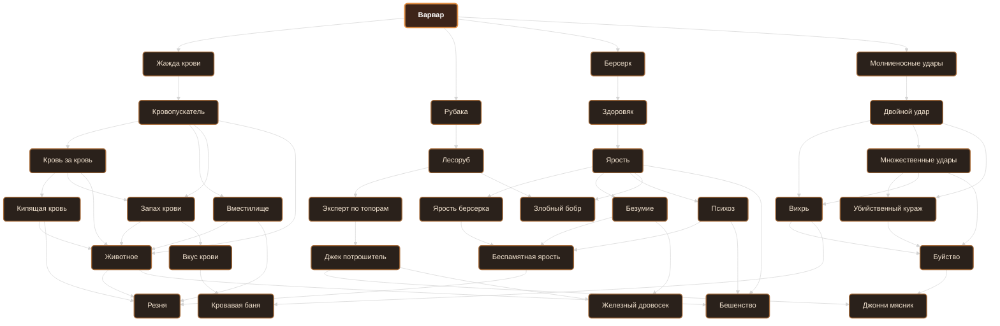

---
{"dg-publish":true,"permalink":"/Система/Классы и развитие/Деревья развития/Варвар/Древо перков/","dg-note-properties":{}}
---

```mermaid
flowchart TD
    %%{init: {'theme': 'dark', 'flowchart': {'curve': 'basis', 'nodeSpacing': 40, 'rankSpacing': 55}}}%%

    %% Центральный узел класса
    N15["<b>Варвар</b>"]

    %% Ветка крови и кровопускания
    N16["Жажда крови"]
    N14["Кровопускатель"]
    N9["Кровь за кровь"]
    N10["Кипящая кровь"]
    N17["Вместилище"]
    N7["Запах крови"]
    N12["Вкус крови"]
    N11["Кровавая баня"]
    N8["Животное"]

    %% Ветка скорости и множественных ударов
    N31["Молниеносные удары"]
    N30["Двойной удар"]
    N28["Множественные удары"]
    N29["Вихрь"]
    N25["Убийственный кураж"]
    N32["Буйство"]

    %% Ветка топоров и мясника
    N26["Рубака"]
    N4["Лесоруб"]
    N3["Эксперт по топорам"]
    N1["Джек потрошитель"]
    N6["Джонни мясник"]
    N5["Злобный бобр"]
    N2["Железный дровосек"]

    %% Ветка ярости и безумия
    N18["Берсерк"]
    N19["Здоровяк"]
    N24["Ярость"]
    N21["Ярость берсерка"]
    N22["Психоз"]
    N27["Безумие"]
    N23["Беспамятная ярость"]
    N20["Бешенство"]
    N13["Резня"]

    %% Связи дерева
    N15 --> N16
    N16 --> N14
    N14 --> N9
    N7 --> N8
    N9 --> N10
    N14 --> N17
    N17 --> N8
    N10 --> N8
    N9 --> N7
    N14 --> N7
    N9 --> N8
    N14 --> N8
    N30 --> N29
    N30 --> N28
    N30 --> N25
    N28 --> N25
    N28 --> N29
    N28 --> N32
    N29 --> N32
    N25 --> N32
    N15 --> N26
    N26 --> N4
    N4 --> N3
    N3 --> N1
    N15 --> N18
    N18 --> N19
    N19 --> N24
    N24 --> N21
    N21 --> N23
    N22 --> N23
    N27 --> N23
    N24 --> N27
    N24 --> N22
    N7 --> N12
    N12 --> N11
    N29 --> N11
    N32 --> N6
    N1 --> N6
    N1 --> N2
    N27 --> N2
    N24 --> N5
    N24 --> N20
    N22 --> N20
    N23 --> N13
    N17 --> N13
    N8 --> N13
    N10 --> N13
    N8 --> N20
    N4 --> N5
    N15 --> N31
    N31 --> N30

    %% Стилизация карточек под твою палитру
    classDef perk fill:#2a211b,stroke:#a66c3b,stroke-width:2px,color:#f5e6d3,rx:6,ry:6
    classDef core fill:#3d2419,stroke:#e08e45,stroke-width:3px,color:#ffffff,rx:6,ry:6
    class N1,N2,N3,N4,N5,N6,N7,N8,N9,N10,N11,N12,N13,N14,N16,N17,N18,N19,N20,N21,N22,N23,N24,N25,N26,N27,N28,N29,N30,N31,N32 perk
    class N15 core
    
        %% Кликабельные ссылки на страницы перков
    click N1 "/система/классы%20и%20развитие/деревья%20развития/варвар/узлы/джек%20потрошитель/" "Открыть"
    click N2 "/система/классы%20и%20развитие/деревья%20развития/варвар/узлы/железный%20дровосек/" "Открыть"
    click N3 "/система/классы%20и%20развитие/деревья%20развития/варвар/узлы/эксперт%20по%20топорам/" "Открыть"
    click N4 "/система/классы%20и%20развитие/деревья%20развития/варвар/узлы/лесоруб/" "Открыть"
    click N5 "/система/классы%20и%20развитие/деревья%20развития/варвар/узлы/злобный%20бобр/" "Открыть"
    click N6 "/система/классы%20и%20развитие/деревья%20развития/варвар/узлы/джонни%20мясник/" "Открыть"
    click N7 "/система/классы%20и%20развитие/деревья%20развития/варвар/узлы/запах%20крови/" "Открыть"
    click N8 "/система/классы%20и%20развитие/деревья%20развития/варвар/узлы/животное/" "Открыть"
    click N9 "/система/классы%20и%20развитие/деревья%20развития/варвар/узлы/кровь%20за%20кровь/" "Открыть"
    click N10 "/система/классы%20и%20развитие/деревья%20развития/варвар/узлы/кипящая%20кровь/" "Открыть"
    click N11 "/система/классы%20и%20развитие/деревья%20развития/варвар/узлы/кровавая%20баня/" "Открыть"
    click N12 "/система/классы%20и%20развитие/деревья%20развития/варвар/узлы/вкус%20крови/" "Открыть"
    click N13 "/система/классы%20и%20развитие/деревья%20развития/варвар/узлы/резня/" "Открыть"
    click N14 "/система/классы%20и%20развитие/деревья%20развития/варвар/узлы/кровопускатель/" "Открыть"
    click N15 "/система/классы%20и%20развитие/деревья%20развития/варвар/описание%20и%20особенности/" "Открыть"
    click N16 "/система/классы%20и%20развитие/деревья%20развития/варвар/узлы/жажда%20крови/" "Открыть"
    click N17 "/система/классы%20и%20развитие/деревья%20развития/варвар/узлы/вместилище/" "Открыть"
    click N18 "/система/классы%20и%20развитие/деревья%20развития/варвар/узлы/берсерк/" "Открыть"
    click N19 "/система/классы%20и%20развитие/деревья%20развития/варвар/узлы/здоровяк/" "Открыть"
    click N20 "/система/классы%20и%20развитие/деревья%20развития/варвар/узлы/бешенство/" "Открыть"
    click N21 "/система/классы%20и%20развитие/деревья%20развития/варвар/узлы/ярость%20берсерка/" "Открыть"
    click N22 "/система/классы%20и%20развитие/деревья%20развития/варвар/узлы/психоз/" "Открыть"
    click N23 "/система/классы%20и%20развитие/деревья%20развития/варвар/узлы/беспамятная%20ярость/" "Открыть"
    click N24 "/система/классы%20и%20развитие/деревья%20развития/варвар/узлы/ярость/" "Открыть"
    click N25 "/система/классы%20и%20развитие/деревья%20развития/варвар/узлы/убийственный%20кураж/" "Открыть"
    click N26 "/система/классы%20и%20развитие/деревья%20развития/варвар/узлы/рубака/" "Открыть"
    click N27 "/система/классы%20и%20развитие/деревья%20развития/варвар/узлы/безумие/" "Открыть"
    click N28 "/система/классы%20и%20развитие/деревья%20развития/варвар/узлы/множественные%20удары/" "Открыть"
    click N29 "/система/классы%20и%20развитие/деревья%20развития/варвар/узлы/вихрь/" "Открыть"
    click N30 "/система/классы%20и%20развитие/деревья%20развития/варвар/узлы/двойной%20удар/" "Открыть"
    click N31 "/система/классы%20и%20развитие/деревья%20развития/варвар/узлы/молниеносные%20удары/" "Открыть"
    click N32 "/система/классы%20и%20развитие/деревья%20развития/варвар/узлы/буйство/" "Открыть"
```

